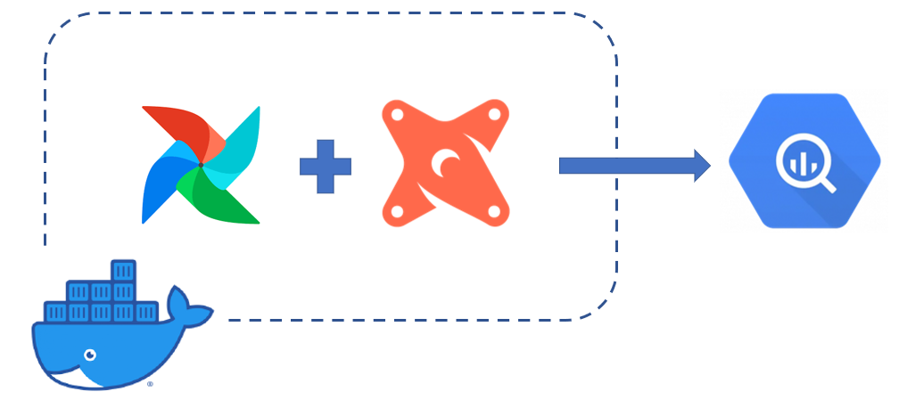
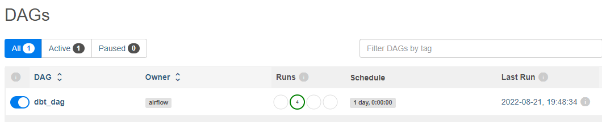
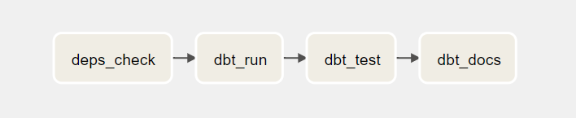
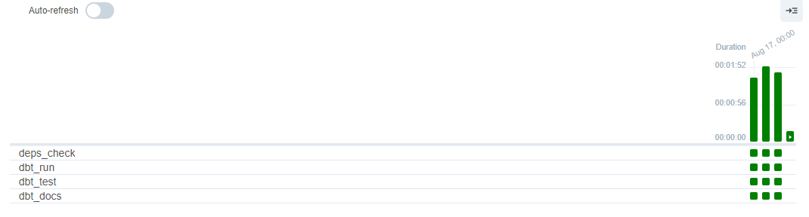
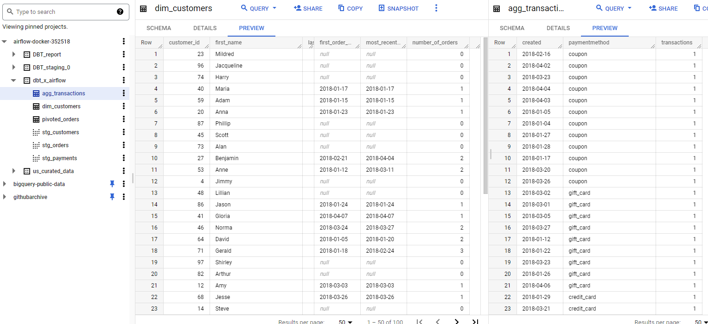

# <p align=center>DBT PROJECT WITH AIRFLOW</p>

## INTRO
In this project, from [dbt Fundamental course](https://courses.getdbt.com/courses/fundamentals), the dbt project of jaffleshop was used with and upgrade of intergrating Airflow to automating daily run of dbt project.
<p align="center">
  
</p>

## SETUP 
### Prerequisite
- Docker Desktop
- BigQuery account
- dbt Core (with Big Query plugin)
- Dockerfile is based off `python:3.9` image, with dbt and aitflow installed on top.

## AIRFLOW
Airflow dag was simply design to mainly run dbt models, test models, and generate documentations. 
 - Dag filepath: `./airflow/dags/dbt_project.py`
 <p align="center">
 
  
</p>

## Running
```
> docker build -t dbt-air . (run one time to build the image)
> docker run -d --rm -p 8080:8080 -v {host-volume-path}/dbt-airflow:/dbt-airflow dbt-air (for detached container)
> docker run -ti --rm -p 8080:8080 -v {host-volume-path}/dbt-airflow:/dbt-airflow dbt-air (for bebugging)
```
- Server at: <http://localhost:8080> (login & password: `vanmai40`, `airflow`)

<p align="center">

</p>

- dbt project run by airflow dag, and data get populated
<p align="center">
  
</p>

